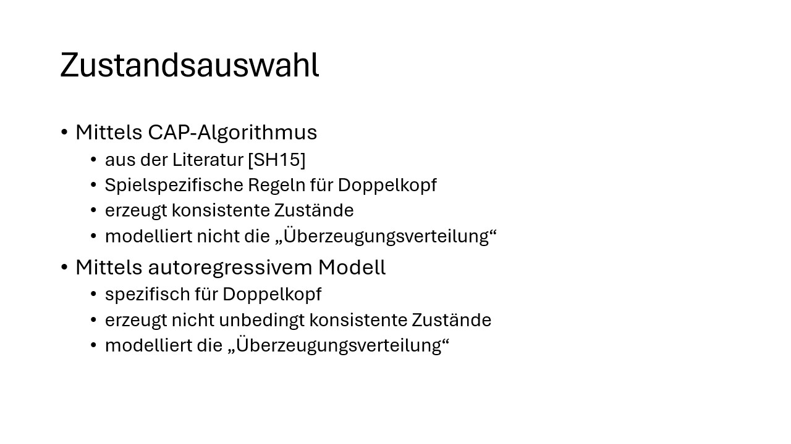
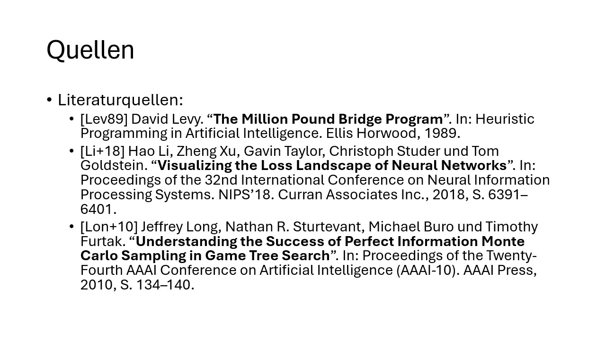
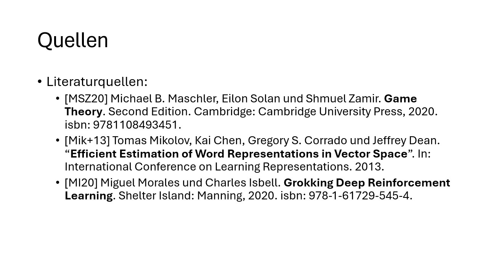
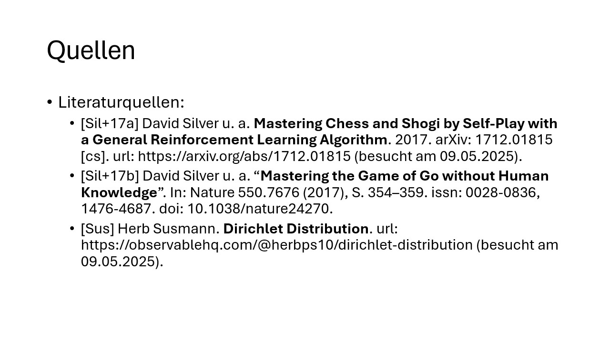

# Adaption von MCTS und AlphaZero für Spiele mit imperfekter Information am Beispiel Doppelkopf
Hier befindet sich der Source Code, der im Rahmen der Abschlussarbeit "Adaption von MCTS und AlphaZero für Spiele mit imperfekter Information am Beispiel Doppelkopf" an der Fernuniversität in Hagen unter Betreuung von [Dr. Fabio Valdés](https://www.fernuni-hagen.de/mi/fakultaet/lehrende/valdes/index.shtml) enstand.

Die schriftliche Ausarbeitung ist im Repository unter [/docs/final.pdf](/docs/final.pdf) zu finden. Die zugehörige Abschlusspräsentation ist unter [/docs/final.pptx](/docs/final.pptx).

## Zusammenfassung der Arbeit
Das automatische Spielen von Brett- und Computerspielen dient traditionell
als wichtiges Testfeld und Anwendungsgebiet für Fortschritte in der künstli-
chen Intelligenz (KI). Während für Spiele mit perfekter Information, wie Go
oder Schach, bereits herausragende Erfolge erzielt wurden, stellen Spiele mit
imperfekter Information, bei denen Spieler nur einen Teil des Spielzustands
beobachten können, aufgrund der daraus resultierenden Unsicherheiten nach
wie vor eine große Herausforderung dar.

Diese Arbeit untersucht, wie das etablierte Suchverfahren Monte Carlo Tree
Search (MCTS) sowie das Lernverfahren AlphaZero, die in ihrer Grundform
nur auf Spiele mit perfekter Information anwendbar sind, so erweitert werden
können, dass sie auch auf Spiele mit imperfekter Information angewendet wer-
den können. Hierfür wird der Ansatz der Determinisierung verfolgt: Aus der
unvollständigen Beobachtung eines Spielers werden zunächst ein oder meh-
rere plausible vollständige Spielzustände rekonstruiert. Auf diesen rekonstru-
ierten Zuständen werden anschließend der MCTS und AlphaZero ausgeführt.
Für die Zustandsrekonstruktion kommen sowohl ein statischer, regelbasierter
Algorithmus als auch ein trainierbares autoregressives Modell, basierend auf
der Transformer-Architektur, zum Einsatz.

Der vorgestellte Ansatz wird exemplarisch am deutschen Kartenspiel Dop-
pelkopf evaluiert. Als Stichspiel mit vier Spielern, die in teils unbekannten
Partnerschaften agieren, bietet Doppelkopf strategische Tiefe und dient als
geeignetes Testfeld für die entwickelten Methoden. Die Evaluierung der resul-
tierenden Spielstärke anhand mehrerer spielspezifischer Metriken zeigt, dass
das autoregressive Modell zuverlässig plausible Zustände generiert und der
Determinisierungsansatz zu einer kompetenten, wenn auch nicht optimalen,
Spielstrategie führt. Die Arbeit beleuchtet abschließend die konzeptionellen
und praktischen Limitationen dieses Ansatzes und die Anwendbarkeit auf
andere Spiele.

## Abschlusspräsentation

